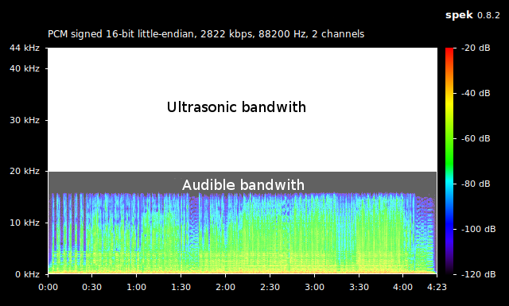
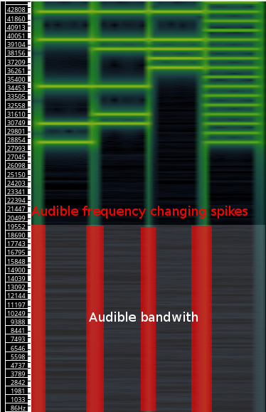
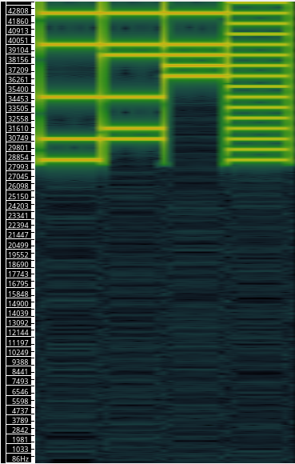
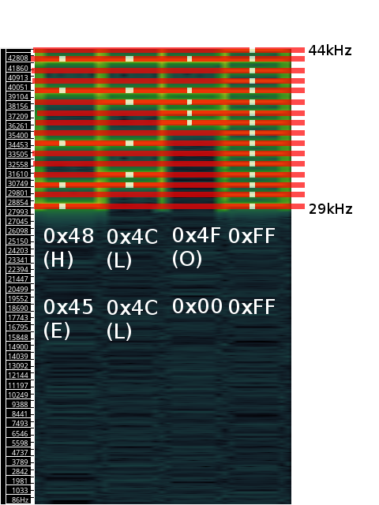

# Hiding data inside  generic loseless audio file
___
There's no motivation about why developing something like this, maybe it's also already implemented in somehow, but whatever.
I was wondering about the possibility of hiding something in an existent information.
Than my little telecomunications knowledge came up.
Thanks to Fourier's theorem about his series saying something like

> We are able to see a periodic function **f(t)** observed in his time domain **t** reported to his frequency domain **F** like an opportune sinous operation with appropriate amplitude, phase and frequency sinous functions.

Now, thinking about an audio signal like a generic function with a frequency domain limited from 20Hz to 20kHz, as the human ear audible frequency interval.
We could just sum some sinous signal with higher frequency than 20kHz so we cannot hear them.
The only little problem on doing this is the necessity of an extended sampling rate to include an ultrasonic band big enought: that's the impossibility to use standard 44100Hz sampling wav file because of Nyquist-Shannon sampling theoreme saying that is necessary at least twice the top bandwith sampling frequency to describe an univoque signal.
So with 44100Hz we can describe only signals from 0Hz to 22050Hz, leaving only almost 2kHz of ultrasonic bandwith able of storing data, so it can be only 0/1 storing, needing longer tracks to store same informations.
So, we can store more data in a single interval by incrementing audio sampling rate.

As seen from image above, in a normal 44100Hz sampled file there are left only 2kHz of ultrasonic bandwith where we can only write 0/1 data at 22kHz and 21kHz frequencies.

As incremented the sampling rate, we have now available a bigger bandwith for our data that can't be heared by user.

Than we need to transform our data into a sum of sinweaves.
Let's define that every bit in a word has a frequency inside our spectrogram.
There will be:
* MSB: 44kHz
* 43kHz
* ...
* 30kHz
* LSB: 29kHz

 

After first signal generation we can see data periods containing informations, we will analyze them after, but we can also see some frequency changing spikes due to the variation of the data.
On the left you can see the same signal after has been processed by an high pass filter.

Reading informations is almost easy:
As you can see by the image above, the tracks in a single period are the relative bit of the word.
